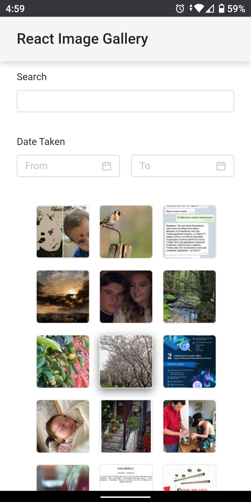
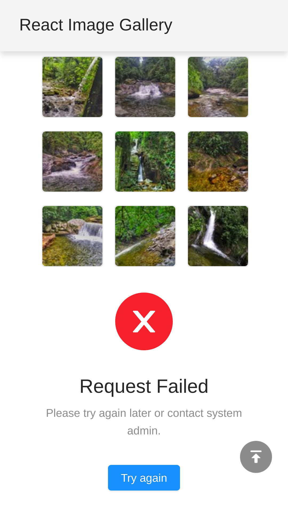
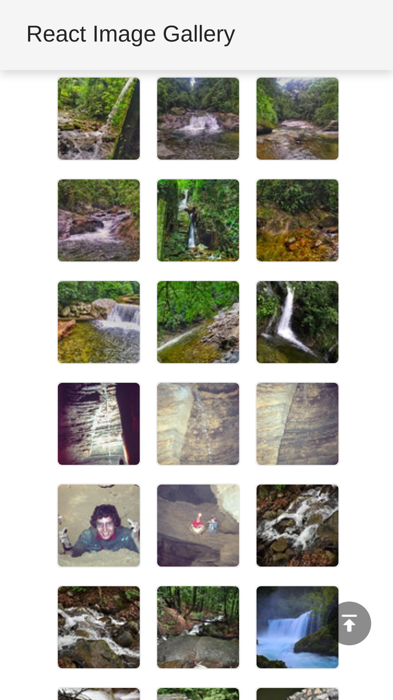

# React Image Gallery

[](https://standardjs.com)

A mobile-first image gallery Progressive Web App (PWA) built with React, React Hooks and Flickr.

<p align="center">
  
</p>

## Motivation

This app was built as part of an interview assignment. The assignment document is [here](https://github.com/ecgan/react-image-gallery/blob/master/docs/Frontend%20Developer%20Exercise.pdf).

A quick summary:

> Basic functional requirements:
>
> - Display the photos loaded from the API in a grid containing 3 images in a row
> - Search functionality
> - Filter functionality (e.g. page size, category, tags, etc.)
> - Pagination
>
> Nice to have functional requirements:
>
> - Responsiveness
> - Infinite/Continuous Scroll

This app fulfills all of the above. It took me about one weekend in December 2019 to complete most of the app.

## Usage

### Prerequisite

This app uses the Flickr API services. To run this app on your own, you need to sign up for Flickr and request an API key [here](https://www.flickr.com/services/apps/create/).

### Running this app locally

1. Checkout this code repository.
2. Create a `.env` file in the root folder, and put in the following:

    ```text
    HTTPS=true   # true to run local server in https mode.
    PORT=3811    # port number for the local server to listen on.
    REACT_APP_FLICKR_API_KEY=<YOUR FLICKR API KEY HERE>
    ```
  
    For more info on the `.env` file and the environment variables, visit the following pages on create-react-app site:
  
    - [Adding Custom Environment Variables](https://create-react-app.dev/docs/adding-custom-environment-variables/)
    - [Advanced Configuration](https://create-react-app.dev/docs/advanced-configuration/).

3. Run `npm install` to install the dependencies.
4. Run `npm run start` to start the app in local server.

### Deploying the app

1. Make sure you have the `.env` file with `REACT_APP_FLICKR_API_KEY` specified inside.
2. Run `npm run build`. The production app will be generated in the `build` folder.
3. Deploy the files in the `build` folder onto the hosting of your choice, e.g [Amazon S3](https://aws.amazon.com/s3/), [Google Cloud Storage](https://cloud.google.com/storage), or [Firebase Hosting](https://firebase.google.com/products/hosting).

## Features

From user perspective, this app is pretty simple and does what it says in the requirements. Users can search for photos by keyword, filter the photos by date taken, and click on the photo thumbnail to view larger version. As users scroll through the list, more photos will be loaded.

However, as a person who cares about user experience, there are a few things that I've put in to make it better.

### Progressive Web App

This image gallery web app is built as a progressive web app, meaning:

- The app is loaded and cached locally. This makes subsequent load faster and can be run offline.
- The app can be added to the home screen of your mobile phone. Users are able to access the app quickly without having to open the web browser.

### Display Recent Photos When There Is No Search/Filter

When users first start the app, there is no search term and no filter being set. The app will load recent latest photos from Flickr API. With this, users will be seeing some photos even though they haven't entered anything yet.

### Infinite Scroll

When the app makes a request to Flickr API, it will request 30 photos at a time. This means users will see 10 rows of three images. As users scroll near to the bottom of the list, the app will make another request to get the next 30 photos, and then append it to the bottom of the list. This gives users the "infinite scroll" experience.

### Error Handling

Imagine you are searching for some waterfall photos in the app. While scrolling down through the list of hundreds of photos, your network connection is down.

The app will show you an error message saying that the request failed. However, it doesn't stop you from scrolling up and viewing the previously loaded photos.

<p align="center">
  
</p>

When your network connection is up again, you can click on the "Try again" button, and you will continue where you were left off. You don't need to start all over again.

<p align="center">
  
</p>

## Technical Implementation

The above features are nice and fancy, but the things under the hood are even better.

### Custom `useFlickr` React Hook

The most important core piece of code to support the features above lies in the custom `useFlickr` React Hook that I build.

```javascript
const query = {
  text: '', // search term.
  min_taken_date: 0, // taken start date in unix timestamp format.
  max_taken_date: 0  // taken end date in unix timestamp format.
}

const { loading, error, data, fetchMore, refetch } = useFlickr(query)
```

Inside `useFlickr`, it uses `useReducer` React Hook to maintain state. It uses `useEffect` React Hook to call Flickr SDK which will fire HTTP request to Flickr API service.

`loading` will be true when there is an ongoing request to Flickr API. `error` is the error object thrown by the Flickr API. `data` contains the photos returned from the current query.

When users scroll to the bottom of the list and triggers the infinite scroll, `fetchMore` will be called. It will request the next 30 photos for the current search query and append them to the existing list of photos in `data`.

When users hit an error and then click on the "Try again" button, `refetch` will be called. It will re-request the current set of 30 photos for the current search query and append them to the list upon success.

When users change the search term or the date filter, the list of photos in `data` will be cleared and then updated with the new result.

**Request cancellation** is also supported. If users change the search term or the date filter while there is an in-flight request, the in-flight request will be aborted, and a new request will be fired for the new query.

The `useFlickr` hook signature is inspired by [Apollo Graphql's `useQuery` React Hook](https://www.apollographql.com/docs/react/api/react-hooks/#usequery).

### Testing

Testing is done using [React Testing Library](https://testing-library.com/docs/react-testing-library/intro). Currently there is 90%+ code coverage.

## Future Work

- Use [Cypress](https://www.cypress.io/) for end-to-end testing.
- Make use of React Context to provide Flickr client.
- Upgrade to [Ant Design 4.x](https://ant.design/) version.

## Issues / Questions

Feel free to open a GitHub issue, or reach out to me on [Twitter](https://twitter.com/ecgan) or [LinkedIn](https://www.linkedin.com/in/ecgan).
